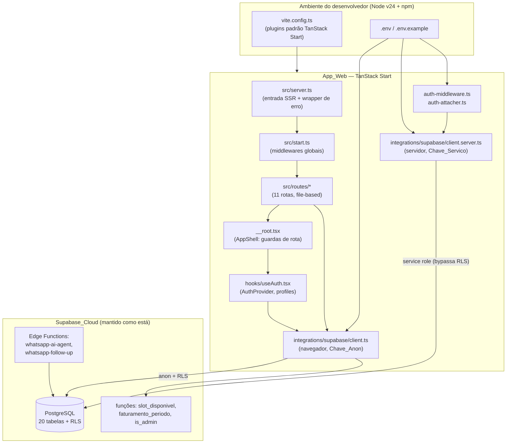

# Documento de Design

## Overview
<!-- Visão Geral -->

Este design descreve como **finalizar profissionalmente** o sistema de gestão da
**Barbearia Status**, removendo todo o lock-in da plataforma Lovable e tornando o
frontend/build independentes, mantendo o backend Supabase em nuvem atual
(projeto `tkztzgpryhioilwrhern`) como padrão e sem migração de banco de dados.

O projeto já existe em estágio avançado: 11 rotas (`src/routes`), cliente/admin Supabase,
middleware de autenticação, controle de acesso por papel, 12 migrações e 2 Edge Functions.
Portanto, o trabalho **não é reconstruir**, e sim:

1. **Substituir a configuração de build proprietária** (`@lovable.dev/vite-tanstack-config`)
   por uma composição padrão e explícita de plugins do TanStack Start + Vite.
2. **Migrar o gerenciador de pacotes** de `bun` para `npm`, eliminando o registro privado
   da Lovable e o lockfile do bun.
3. **Remover marcas, URLs e mensagens** da Lovable do código versionado.
4. **Tornar a configuração do Supabase independente**, incluindo o tratamento seguro da
   `SUPABASE_SERVICE_ROLE_KEY` (somente servidor).
5. **Verificar (auditar) cada módulo funcional** contra o schema vivo do Supabase, sem
   reescrever lógica que já funciona, e completar lacunas pontuais.
6. **Documentar e/ou desativar com segurança** as Edge Functions de WhatsApp.
7. **Garantir qualidade de código**: type-check, lint e build verdes; rotas preservadas.

O princípio orientador é **"sem gambiarras"**: cada substituição da Lovable produz uma
configuração padrão, idiomática e documentada, equivalente em comportamento à anterior.

### Escopo e não-escopo

| Em escopo | Fora de escopo |
|-----------|----------------|
| Configuração de build (`vite.config.ts`) | Migração do banco de dados Supabase |
| Migração `bun` → `npm` | Reescrita de módulos funcionais que já operam |
| Remoção de marca/URLs/mensagens Lovable | Mudança do provedor de nuvem (continua Supabase Cloud) |
| Configuração de ambiente + `.env.example` + docs | Novas funcionalidades de produto |
| Tratamento seguro da chave de serviço | Implementação de novos fluxos de UI |
| Auditoria/conclusão dos módulos 7–14 | Troca de bibliotecas (React Query, shadcn/ui) |
| Documentação/desativação das Edge Functions | Reescrita das Edge Functions |
| Qualidade de código (tsc, eslint, build) | |

### Pesquisa relevante

- **TanStack Start + Vite**: o plugin oficial `tanstackStart` é fornecido por
  `@tanstack/react-start/plugin/vite`. O pacote `@tanstack/react-start` já está em
  `dependencies`, então o plugin está disponível sem novas instalações. A ordem correta é
  `tanstackStart()` **antes** de `viteReact()` — o TanStack Start precisa transformar as
  rotas/SSR antes do plugin React aplicar Fast Refresh, caso contrário ocorrem erros de
  HMR e de transformação de JSX no SSR.
- **Target de build**: o wrapper da Lovable usava `nitro` com alvo padrão `cloudflare`.
  Para execução/implantação local e padrão, o alvo `node-server` do Nitro (via TanStack
  Start `target: "node-server"`) é o adequado, gerando um servidor Node executável com
  `node .output/server/index.mjs`. Isso é compatível com o `src/server.ts` (entrada SSR).
- **Entrada de servidor**: o TanStack Start aceita `server: { entry: "./src/server.ts" }`
  para redirecionar a entrada SSR ao wrapper de erro existente — preserva o comportamento
  do Requisito 1.3.
- **Alias `@`**: hoje resolvido pelo wrapper. Com `vite-tsconfig-paths` (já presente em
  `dependencies`) somado ao `paths` do `tsconfig.json` (`"@/*": ["./src/*"]`), o alias é
  preservado de forma padrão (Requisito 1.4), sem precisar declarar `resolve.alias` manual.
- **Tailwind 4**: `@tailwindcss/vite` já está presente; é o plugin oficial do Tailwind v4.
- **npm vs bun**: Node v24 está disponível, `bun` não. O `npm install` lê o `package.json`
  e gera `package-lock.json` apontando para `registry.npmjs.org`. As versões do
  `@supabase/*` (`2.106.2`) existem publicamente no registro npm, então não há
  dependências exclusivas do registro privado da Lovable.

## Architecture
<!-- Arquitetura -->

O sistema permanece em duas camadas: **App_Web** (TanStack Start, SSR + cliente React) e
**Supabase_Cloud** (Auth + PostgreSQL + Edge Functions). A finalização atua principalmente
na fronteira de build e configuração da App_Web.



### Camadas e responsabilidades

| Camada | Arquivos | Responsabilidade | Mudança nesta finalização |
|--------|----------|------------------|---------------------------|
| Build | `vite.config.ts`, `package.json`, `tsconfig.json` | Compilar/empacotar | Substituir wrapper Lovable; migrar para npm |
| Entrada SSR | `src/server.ts`, `src/start.ts` | Render SSR + middlewares | Preservar (apenas garantir redirecionamento via config) |
| Roteamento/guarda | `src/routes/__root.tsx` | Guardas público/admin | Remover URLs de marca; auditar guardas |
| Auth | `src/hooks/useAuth.tsx`, `auth-middleware.ts`, `auth-attacher.ts` | Sessão e papel | Remover mensagem de marca; auditar |
| Acesso a dados (browser) | `integrations/supabase/client.ts` | Cliente anon + RLS | Ler env próprias; remover mensagem de marca |
| Acesso a dados (servidor) | `integrations/supabase/client.server.ts` | Service role | Ler `SUPABASE_SERVICE_ROLE_KEY`; remover marca |
| Módulos funcionais | `src/routes/*.tsx` | Telas e lógica de negócio | Auditar contra schema; completar lacunas |
| Edge Functions | `supabase/functions/*` | Integração WhatsApp | Documentar/URL própria/desativar |

## Components and Interfaces
<!-- Componentes e Interfaces -->

### 1. Configuração de build (`vite.config.ts`)

**Antes (dependente da Lovable):**

```typescript
import { defineConfig } from "@lovable.dev/vite-tanstack-config";

export default defineConfig({
  tanstackStart: {
    server: { entry: "server" },
  },
});
```

**Depois (composição padrão e explícita):**

```typescript
import { defineConfig } from "vite";
import { tanstackStart } from "@tanstack/react-start/plugin/vite";
import viteReact from "@vitejs/plugin-react";
import tailwindcss from "@tailwindcss/vite";
import tsConfigPaths from "vite-tsconfig-paths";

export default defineConfig({
  plugins: [
    // Resolve "@/*" a partir do tsconfig (Requisito 1.4)
    tsConfigPaths({ projects: ["./tsconfig.json"] }),
    // TanStack Start ANTES do plugin React (Requisito de ordenação)
    tanstackStart({
      // Redireciona a entrada SSR para o wrapper de erro (Requisito 1.3)
      server: { entry: "./src/server.ts" },
      // Alvo de servidor Node para execução/implantação local padrão
      target: "node-server",
    }),
    viteReact(),
    tailwindcss(),
  ],
});
```

Decisões de design:
- **Ordem `tanstackStart` → `viteReact`**: obrigatória; o Start transforma rotas/SSR antes
  do React aplicar Fast Refresh. Atende ao Requisito 1.7 (cada plugin uma única vez, sem
  duplicação que o wrapper escondia).
- **`target: "node-server"`**: substitui o alvo `cloudflare` padrão do wrapper, adequado a
  Node v24 local. O artefato é executável com `node .output/server/index.mjs`.
- **Sem `resolve.alias` manual**: `vite-tsconfig-paths` cobre o alias `@`, evitando
  configuração redundante (Requisito 1.4).
- **Remoção do `componentTagger`** (dev-only da Lovable): não é recriado (Requisito 2.5).

### 2. Gerenciador de pacotes (`package.json`, lockfiles)

Interface de mudança:
- Remover de `devDependencies`: `@lovable.dev/vite-tanstack-config` (Requisitos 1.2, 16.3).
  Avaliar `lovable-tagger` (não presente em `package.json` atual; remover se aparecer).
- Remover `nitro` como dependência direta declarada apenas para o wrapper, **se** não for
  exigida pela resolução do `tanstackStart` (verificar no `tsc`/build; manter se exigida).
- Adicionar como `devDependencies` diretas os plugins agora importados explicitamente caso
  ainda não estejam: `@tanstack/react-start` (já em `dependencies`), `@vitejs/plugin-react`
  (já presente), `@tailwindcss/vite` (já presente), `vite-tsconfig-paths` (já presente). Ou
  seja, nenhuma instalação nova é necessária além de remover o wrapper.
- Excluir `bun.lock` e `bunfig.toml` (Requisito 3.3) — eliminam a referência ao registro
  `europe-west4-npm.pkg.dev/lovable-core-prod`.
- Gerar `package-lock.json` via `npm install` (Requisitos 3.1, 3.2, 3.4).

### 3. Remoção de marca (Requisito 2)

| Local | Conteúdo atual | Ação |
|-------|----------------|------|
| `src/routes/__root.tsx` | `og:image`/`twitter:image` em `r2.dev/...lovable.app...png` | Remover as duas meta tags de imagem (ou apontar para imagem em `public/`) |
| `src/integrations/supabase/client.ts` | "Connect Supabase in Lovable Cloud" | Trocar por mensagem neutra com nome da variável |
| `src/integrations/supabase/client.server.ts` | mesma frase | mesma troca |
| `src/integrations/supabase/auth-middleware.ts` | mesma frase | mesma troca |
| `supabase/functions/whatsapp-ai-agent/index.ts` | `bookingLink = "https://barbearia-status.lovable.app/agendar"` | Ler de env `PUBLIC_BOOKING_URL` (fallback domínio próprio) |
| `public/funcoes_ia.html` | link `barbearia-status.lovable.app/agendar` | Substituir pela URL própria do usuário |

Mensagem de erro neutra padronizada (Requisitos 2.2–2.4, 4.5, 5.6):
```
Missing Supabase environment variable(s): <lista>. Configure-as no arquivo .env (veja .env.example).
```

Critério de verificação: busca textual por "lovable" no código versionado (excluindo
`node_modules` e o `package-lock.json`) deve retornar zero ocorrências (Requisito 2.8). O
diretório `.lovable/` e `bun.lock` são removidos.

### 4. Configuração do Supabase e ambiente

**Cliente do navegador** (`client.ts`) — lê `import.meta.env.VITE_SUPABASE_URL` /
`VITE_SUPABASE_PUBLISHABLE_KEY` com fallback para `process.env.SUPABASE_URL` /
`SUPABASE_PUBLISHABLE_KEY` no SSR (Requisito 5.1). Comportamento atual mantido; apenas a
mensagem de erro muda.

**Cliente admin do servidor** (`client.server.ts`) — lê `process.env.SUPABASE_URL` e
`process.env.SUPABASE_SERVICE_ROLE_KEY` (Requisito 5.2). A chave de serviço **nunca** recebe
prefixo `VITE_` e **nunca** é lida via `import.meta.env`, garantindo que não chega ao
navegador (Requisito 5.3). Quando ausente, erro nomeia `SUPABASE_SERVICE_ROLE_KEY`
(Requisito 5.6).

**Variáveis de ambiente:**

| Variável | Escopo | Obrigatória | Segredo | Descrição |
|----------|--------|-------------|---------|-----------|
| `VITE_SUPABASE_URL` | cliente + SSR | Sim | Não | URL do projeto Supabase |
| `VITE_SUPABASE_PUBLISHABLE_KEY` | cliente + SSR | Sim | Não | Chave anon/publishable |
| `SUPABASE_URL` | servidor | Sim | Não | URL do projeto (server-side) |
| `SUPABASE_PUBLISHABLE_KEY` | servidor | Sim | Não | Chave anon usada pelo middleware de auth |
| `SUPABASE_SERVICE_ROLE_KEY` | servidor | Sim (p/ ops admin) | **Sim** | Chave de serviço; bypassa RLS |
| `VITE_SUPABASE_PROJECT_ID` | cliente | Opcional | Não | ID do projeto (informativo) |
| `PUBLIC_BOOKING_URL` | edge/conteúdo | Opcional | Não | URL pública de agendamento própria |

`.env.example` lista todas as variáveis com placeholders, sem valores reais (Requisito 4.3).
`.gitignore` deve conter `.env` (e variantes com segredos) e `.lovable/` (Requisito 5.7).

### 5. Autenticação e controle de acesso (Requisito 6)

Componentes existentes e sua interface:
- `AuthProvider`/`useAuth` (`src/hooks/useAuth.tsx`): expõe `{ user, session, profile,
  loading, isAdmin, signIn, signOut }`. Carrega `profiles` por `id` do usuário; `isAdmin`
  deriva de `profile.tipo === "admin"`.
- `AppShell` (`__root.tsx`): aplica guardas com `PUBLIC_PATHS = ["/login", "/agendar"]` e
  `ADMIN_ONLY = ["/comandas", "/clientes", "/financeiro", "/estoque", "/relatorios",
  "/configuracoes"]`. Redireciona não autenticados a `/login`, barbeiros em rota admin a
  `/agenda`, e usuário logado em `/login` a `/agenda`. Mostra "Carregando…" enquanto
  `loading` (Requisito 6.8).

**Criação do Admin inicial** (Requisito 4.4): documentar no Doc_Setup o procedimento via
painel Supabase — criar usuário em Authentication; o trigger `handle_new_user` cria a linha
em `profiles` com `tipo` padrão; em seguida atualizar `profiles.tipo = 'admin'` via SQL
editor (a função `is_admin` valida o papel para as políticas RLS).

### 6. Auditoria dos módulos funcionais (Requisitos 7–14)

Como o código já existe, a estratégia é **auditar/verificar** cada módulo contra o schema
vivo e completar lacunas pontuais, em vez de reescrever. Matriz de auditoria:

| Módulo | Rota | Tabelas/Funções | Pontos a verificar |
|--------|------|-----------------|--------------------|
| Agenda | `/agenda` | `appointments`, `slot_disponivel` | Listagem por período; criação; checagem de slot; geração de comanda ao finalizar (Req 7) |
| Comandas | `/comandas`, `/comandas/$id` | `commands`, `command_items` | Listar; detalhe; recálculo do total ao add/remover item (Req 8.1–8.3) |
| Caixa/Pagamento | `/comandas/$id`, `/financeiro` | `cash_registers`, `cash_movements`, `transactions` | Bloqueio sem caixa aberto; troco; movimento ao pagar (Req 8.4–8.6) |
| Clientes | `/clientes` | `clients`, `dependents` | Listar/criar/editar; validar obrigatórios; dependentes (Req 9) |
| Financeiro | `/financeiro` | `cash_registers`, `cash_movements` | Abrir/fechar caixa; saldo final; bloqueio de 2ª abertura (Req 10) |
| Estoque | `/estoque` | `stock_items`, `stock_movements` + trigger `update_stock_quantity` | Entrada/saída/ajuste; impedir saída > disponível (Req 11) |
| Relatórios | `/relatorios` | `faturamento_periodo`, `daily_settlements`, `advances` | Faturamento por período; acertos; vales; atualização ao mudar período (Req 12) |
| Configurações | `/configuracoes` | `professionals`, `services`, `settings`, `profiles` | CRUD de cadastros base; criar usuário com papel (Req 13) |
| Agendamento público | `/agendar` | `appointments`, `slot_disponivel` | Form público sem login; confirmação; indisponibilidade (Req 14) |

Observação importante de auditoria (Estoque, Req 11.4): hoje a validação de saída que
excede o disponível **não está garantida no cliente** — `MovDialog` insere a movimentação e
o trigger `update_stock_quantity` subtrai sem barreira, podendo gerar quantidade negativa.
A finalização deve adicionar validação (no cliente e/ou via verificação de quantidade) que
impeça saída maior que `quantidade` disponível e informe insuficiência.

### 7. Edge Functions de WhatsApp (Requisito 15)

- `whatsapp-ai-agent`: documentar variáveis `OPENAI_API_KEY`, `EVOLUTION_API_URL`,
  `EVOLUTION_API_KEY`, `SUPABASE_URL`, `SUPABASE_SERVICE_ROLE_KEY`. Trocar `bookingLink`
  fixo por leitura de env `PUBLIC_BOOKING_URL` (Requisitos 15.1, 15.4, 2.6). Quando faltar
  variável obrigatória, já retorna erro sem expor segredos (Requisito 15.3) — verificar.
- `whatsapp-follow-up`: documentar e tratar igualmente.
- **Estratégia de desativação** (Requisito 15.5): documentar que, sem configurar os
  segredos das funções e sem implantá-las, o restante do Sistema funciona normalmente; as
  funções podem permanecer não implantadas ou ser removidas do deploy sem afetar a App_Web.

### 8. Qualidade de código (Requisito 16)

- `tsc --noEmit` sem erros (Requisito 16.1).
- `eslint .` sem erros, usando o `eslint.config.js` existente (Requisito 16.2).
- `vite build` conclui (Requisitos 1.5, 16.4).
- Remoção de arquivos/configs exclusivos da Lovable não referenciados (Requisito 16.3).
- Todas as rotas preservadas após a remoção (Requisito 16.5).

## Data Models
<!-- Modelos de Dados -->

O schema do Supabase é mantido. Os modelos relevantes para a lógica auditada/finalizada:

```typescript
// Perfil do usuário (profiles) — base do controle de acesso
interface Profile {
  id: string;            // = auth.users.id
  nome: string;
  tipo: "admin" | "barbeiro";
  prof_id: number | null;
  avatar: string | null;
  cor: string | null;
}

// Comanda (commands) e item (command_items)
interface Command {
  id: string;
  numero: number;
  cliente_nome: string;
  valor: number;         // total recalculado a partir dos itens
  status: "aberta" | "paga" | string;
  forma_pagamento?: string;
  valor_recebido?: number;
  troco?: number;
  abertura: string;
  fechamento?: string;
}
interface CommandItem {
  id: string;
  command_id: string;
  descricao: string;
  valor: number;         // preço unitário * quantidade
  prof_id: number | null;
  tipo: "servico" | "produto";
}

// Caixa (cash_registers) e movimentação (cash_movements)
interface CashRegister {
  id: string;
  data: string;          // YYYY-MM-DD (UNIQUE)
  valor_inicial: number;
  valor_final: number | null;
  status: "aberto" | "fechado";
}
interface CashMovement {
  id: string;
  cash_id: string;
  tipo: "entrada" | "saida";
  descricao: string;
  valor: number;
  forma_pagamento: string | null;
  hora: string;
}

// Estoque (stock_items) e movimentação (stock_movements)
interface StockItem {
  id: string;
  nome: string;
  unidade: string;
  quantidade: number;
  minimo: number;
  custo: number;
  preco_venda: number;
  ativo: boolean;
}
interface StockMovement {
  id: string;
  item_id: string;
  tipo: "entrada" | "saida" | "ajuste" | "consumo";
  quantidade: number;
  motivo: string | null;
}
```

### Funções puras a extrair para teste

Para tornar a lógica de negócio testável de forma isolada (e independente do Supabase),
as seguintes funções puras serão extraídas para um módulo `src/lib/calculos.ts` e
reutilizadas pelas rotas existentes (sem alterar o comportamento observável):

```typescript
// Total da comanda = soma dos valores dos itens (Req 8.3)
function recalcularTotalComanda(itens: { valor: number }[]): number;

// Troco em pagamento em dinheiro = max(0, recebido - total) (Req 8.5)
function calcularTroco(total: number, recebido: number): number;

// Saldo do caixa = inicial + entradas - saidas (Req 10.4)
function calcularSaldoCaixa(
  valorInicial: number,
  movimentos: { tipo: "entrada" | "saida"; valor: number }[]
): number;

// Aplicação de movimentação ao estoque (Req 11.2, 11.3)
function aplicarMovimentacaoEstoque(
  atual: number,
  tipo: "entrada" | "saida" | "ajuste",
  quantidade: number
): number; // entrada: atual+q; saida: atual-q; ajuste: q

// Valida se uma saída é permitida (Req 11.4)
function saidaPermitida(atual: number, quantidade: number): boolean; // quantidade <= atual
```


## Correctness Properties
<!-- Propriedades de Corretude -->

*Uma propriedade é uma característica ou comportamento que deve permanecer verdadeiro em
todas as execuções válidas de um sistema — essencialmente, uma afirmação formal sobre o que
o sistema deve fazer. As propriedades servem de ponte entre especificações legíveis por
humanos e garantias de corretude verificáveis por máquina.*

As propriedades a seguir cobrem a **lógica de negócio pura** extraída para
`src/lib/calculos.ts` e as funções de decisão de configuração/guarda. Critérios ligados a
infraestrutura, persistência no Supabase, documentação e build são validados por testes de
integração, exemplos ou verificação manual (ver Estratégia de Testes), não por propriedades.

### Property 1: Mensagem de variável de ambiente ausente nomeia exatamente as faltantes

*Para qualquer* subconjunto não vazio das variáveis obrigatórias do Supabase removido do
ambiente, a função de criação do cliente deve lançar um erro cuja mensagem contém o nome de
cada variável ausente e nenhum nome de variável presente, sem incluir qualquer marca da
Lovable.

**Validates: Requirements 4.5, 5.6, 2.2, 2.3, 2.4**

### Property 2: Decisão de guarda de rota por papel e estado

*Para qualquer* combinação de estado de autenticação (autenticado ou não), tipo de perfil
(admin ou barbeiro) e caminho atual (público, restrito a admin, ou comum), a função de
decisão de guarda deve produzir: `/login` quando não autenticado e o caminho não é público;
`/agenda` quando barbeiro acessa caminho restrito a admin; `/agenda` quando autenticado
acessa `/login`; e permanecer no caminho quando admin acessa caminho restrito a admin ou
quando o caminho é permitido ao papel.

**Validates: Requirements 6.1, 6.4, 6.5, 6.6**

### Property 3: Disponibilidade de horário por sobreposição de intervalos

*Para quaisquer* dois agendamentos do mesmo profissional na mesma data, com intervalos
definidos por `[hora, hora + duração]`, o horário solicitado deve ser considerado
indisponível se, e somente se, os intervalos se sobrepõem (e nenhum está cancelado),
espelhando a regra de `slot_disponivel`.

**Validates: Requirements 7.3, 7.5, 14.2, 14.3**

### Property 4: Total da comanda é a soma dos itens

*Para qualquer* lista de itens de comanda, `recalcularTotalComanda` deve ser igual à soma
dos valores dos itens; e adicionar um novo item deve aumentar o total exatamente pelo valor
do item adicionado.

**Validates: Requirements 8.3**

### Property 5: Cálculo do troco

*Para quaisquer* valores de total e de valor recebido, `calcularTroco` deve ser igual a
`max(0, recebido - total)`; e sempre que `recebido >= total`, vale `recebido = total + troco`.

**Validates: Requirements 8.5**

### Property 6: Validação de campo obrigatório

*Para qualquer* valor de campo obrigatório, a validação deve rejeitar a submissão se, e
somente se, o valor for vazio ou composto apenas por espaços em branco, mantendo o estado
inalterado quando rejeitado.

**Validates: Requirements 9.5**

### Property 7: Saldo do caixa

*Para qualquer* valor inicial e *qualquer* lista de movimentos de caixa, `calcularSaldoCaixa`
deve ser igual a `valor_inicial + soma(entradas) - soma(saídas)`.

**Validates: Requirements 10.4**

### Property 8: Movimentação de estoque aplica o delta correto e preserva o invariante não-negativo

*Para qualquer* quantidade atual não negativa e *qualquer* movimentação: uma `entrada` de
`q` resulta em `atual + q`; uma `saida` de `q` só é permitida quando `q <= atual` e resulta
em `atual - q` (nunca negativo); uma movimentação de `saida` com `q > atual` é rejeitada e a
quantidade permanece inalterada; um `ajuste` define a quantidade para `q`.

**Validates: Requirements 11.2, 11.3, 11.4**

## Error Handling
<!-- Tratamento de Erros -->

| Situação | Camada | Comportamento esperado |
|----------|--------|------------------------|
| Variável de ambiente obrigatória ausente | `client.ts`, `client.server.ts`, `auth-middleware.ts` | Lançar erro nomeando as variáveis ausentes; mensagem neutra (sem marca) e logada via `console.error` (Req 2.2–2.4, 4.5, 5.6) |
| `SUPABASE_SERVICE_ROLE_KEY` ausente em operação admin | `client.server.ts` | Erro identificando `SUPABASE_SERVICE_ROLE_KEY` (Req 5.6) |
| Token de auth ausente/ inválido em serverFn | `auth-middleware.ts` | Lançar "Unauthorized" e barrar a operação (Req 6) |
| Pagamento sem caixa aberto | `comandas.$id.tsx` (PaymentDialog) | Bloquear pagamento e exibir aviso para abrir o caixa (Req 8.6) |
| Saída de estoque maior que disponível | `estoque.tsx` (MovDialog) + `saidaPermitida` | Impedir movimentação e informar quantidade insuficiente (Req 11.4) |
| 2ª abertura de caixa | `financeiro.tsx` + UNIQUE(`data`) | Impedir e informar que há caixa aberto (Req 10.5) |
| Horário indisponível | `agenda.tsx`/`agendar.tsx` + `slot_disponivel` | Impedir criação e informar indisponibilidade (Req 7.3, 14.3) |
| Erro de SSR não tratado | `src/server.ts` | Normalizar resposta catastrófica em página de erro 500 (já implementado) |
| Erro de render no cliente | `__root.tsx` (ErrorComponent) | Exibir tela "Algo deu errado" com opção de tentar novamente |
| Variável obrigatória ausente na Edge Function | `whatsapp-ai-agent/index.ts` | Retornar erro identificando a configuração ausente sem expor segredos (Req 15.3) |
| Erro de query (React Query) | rotas | `throw` na `queryFn` → tratado pelos limites de erro do router; toasts via `sonner` para ações |

Princípios:
- Mensagens de erro de configuração devem **nomear a variável** e **nunca expor valores
  secretos**.
- Nenhuma mensagem deve conter referências à Lovable.

## Testing Strategy
<!-- Estratégia de Testes -->

### Abordagem dupla

- **Testes de propriedade (PBT)**: validam as 8 propriedades universais sobre a lógica pura
  de `src/lib/calculos.ts` e funções de decisão (guarda, overlap, validação, mensagem de
  env).
- **Testes de exemplo/unitários**: cenários concretos e casos de borda (login inválido,
  logout, indicador de carregamento, bloqueio de 2ª abertura de caixa, bloqueio de pagamento
  sem caixa).
- **Testes de integração**: interações com o Supabase_Cloud (CRUD de clientes, agendamentos,
  comandas, caixa, relatórios, criação de usuário, bypass de RLS pela service role) — 1 a 3
  exemplos representativos por fluxo.
- **Verificação (smoke) one-shot**: `tsc --noEmit`, `eslint .`, `npm run build`,
  `npm run dev`, `npm install` limpo, grep por "lovable" = 0, inspeção de `.gitignore` e do
  bundle de produção (ausência da service role key).

### Por que PBT se aplica aqui

A lógica financeira e de estoque é composta por **funções puras** (somas, subtrações, regras
de validação e de sobreposição) com espaço de entrada amplo (listas, números, combinações de
estado), onde 100+ iterações revelam casos de borda (listas vazias, valores zero, recebido
< total, q = atual, intervalos adjacentes vs. sobrepostos). Build, IaC, persistência e
documentação **não** se beneficiam de PBT e usam as estratégias acima.

### Biblioteca e configuração de PBT

- **Biblioteca**: `fast-check` (padrão do ecossistema TypeScript/Vitest); executor de testes
  `vitest`. Não implementar PBT do zero.
- **Iterações**: mínimo de **100 por propriedade** (`fc.assert(..., { numRuns: 100 })`).
- **Tag obrigatória** em cada teste de propriedade, referenciando a propriedade do design:
  `// Feature: barbearia-status-finalizacao, Property {número}: {texto}`.
- Cada propriedade do design é implementada por **um único** teste de propriedade.
- Geradores devem cobrir casos de borda: números não negativos com casas decimais, listas
  vazias, `recebido` menor/igual/maior que `total`, `q` igual à quantidade atual, intervalos
  de horário adjacentes e sobrepostos, strings vazias e somente espaços, todos os
  subconjuntos de variáveis de ambiente.

### Mapeamento propriedade → teste

| Propriedade | Função sob teste | Requisitos |
|-------------|------------------|-----------|
| 1 | criação de cliente / mensagem de env | 4.5, 5.6, 2.2–2.4 |
| 2 | `decidirRedirecionamento` (guarda) | 6.1, 6.4, 6.5, 6.6 |
| 3 | regra de overlap (espelho de `slot_disponivel`) | 7.3, 7.5, 14.2, 14.3 |
| 4 | `recalcularTotalComanda` | 8.3 |
| 5 | `calcularTroco` | 8.5 |
| 6 | validação de campo obrigatório | 9.5 |
| 7 | `calcularSaldoCaixa` | 10.4 |
| 8 | `aplicarMovimentacaoEstoque` / `saidaPermitida` | 11.2, 11.3, 11.4 |

### Critérios de aceite cobertos por outras estratégias

- **Integração**: 5.5, 6.2, 7.1, 7.2, 7.4, 8.1, 8.2, 8.4, 9.1–9.4, 10.1–10.3, 12.1–12.3,
  13.1–13.5, 14.1, 15.2.
- **Exemplo/edge**: 2.1, 5.1, 6.3, 6.7, 6.8, 8.6, 10.5, 12.4, 14.4, 15.3.
- **Smoke/manual**: 1.1–1.7, 2.5, 2.8, 3.1–3.5, 4.1–4.4, 4.6, 5.3, 5.4, 5.7, 15.1, 15.4,
  15.5, 16.1–16.5.
